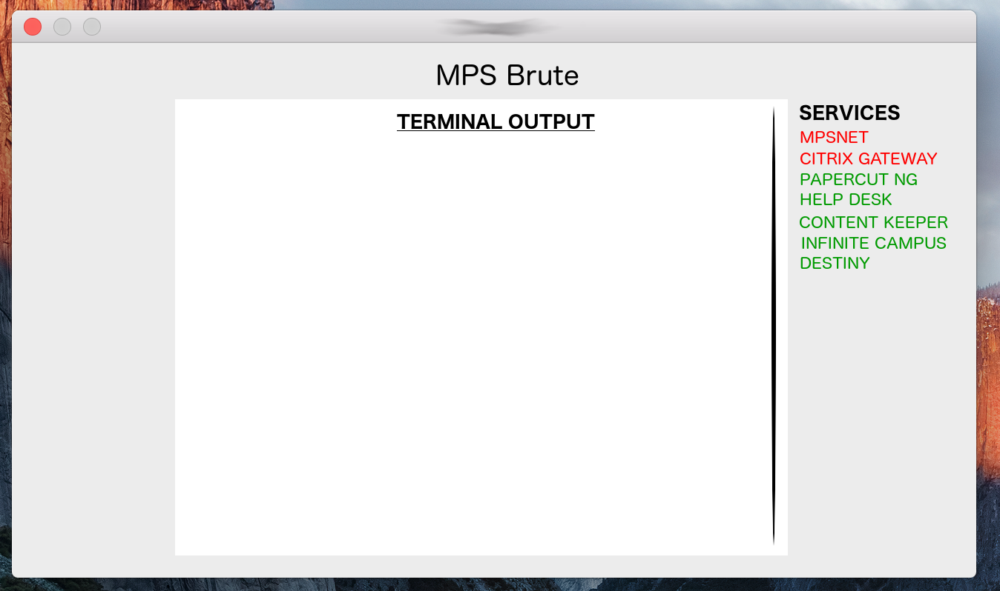

  

# MPSBrute

An application designed as a proof of concept to attack Millard Public Schools logins that are known to be brute forcible. The goal is to bring attention to the fact that our accounts are at risk and action should be taken to prevent this painstakingly easy attack. We have curated a list of usernames exported from Google Contacts and programatically generated a list of possible password combinations from the formula used to generate passwords for Millard's Students. 

Table of Contents
==================

1. [Main Features] (#main-features)
2. [Dependencies] (#dependencies)
3. [Installation] (#installation)
  * [Automatic Installation] (#automatic-installation)
  * [Manual Installation] (#manual-installation)
4. [Usage] (#usage)
  * [Command Line Arguments] (#command-line-arguments)
  * [GUI Interface] (#gui-interface)
4. [Future Integrations] (#future-integrations)
5. [License] (README.md)

Main Features
=============

The concept behind this program is hitting the maximum attempts per minute as your hardware allows, to thread the application, and to hit multiple websites at one time. This will ensure the highest attempts per minute and ensure the smallest amount of time per password.

Our main attack features a highly efficient brute force method running 64 threads per platform across 8 vulnerable websites boasting a massive 3,500 passwords per minute.

Knowing the formula to create the password list for all Millard students, the maximum number of possible password combinations is 50,999. Although this may seem like a large number, 51 thousand combinations faced by multiple computers running this program would last merely minutes. If we take our 51 thousand number divided by the 3,500 per minute our application checks, the math says it would take 14 hours to get each password, and that's under the assumption that they are the last password in the dictionary. (These numbers will be updated when the full application is developed)

Dependencies
============

1. [THC-Hydra] (http://sectools.org/tool/hydra/)
2. [Python 3.0 // 3.6] (HTTPS://www.python.org/)
3. [Java SDK 6.0 // 8.12.1] (http://www.oracle.com/technetwork/java/javase/downloads/jdk8-downloads-2133151.html)

If you are using this application on Kali Linux as recommended, this shouldn't be an issue for you. However, if you are installing this from the source, you could run into trouble if you don't have these installed.

Installation
============

If you are on Kali Linux (recommended), the installation is simple to do with the given <code>.deb</code> file and using the automatic installation. However, if you prefer to install it from source, there is an option for that as well.

Automatic Installation
----------------------

Manual Installation
-------------------

Usage
=====

Command Line Arguments
----------------------
| Argument | Extended Argument | Function Information                                                                                               |
|:--------:|:-----------------:|--------------------------------------------------------------------------------------------------------------------|
|    -h    |       --help      | Displays the help manual on how to use the tool to it's full capabilities.                                         |
|    -v    |     --verbose     | Turns on verbose mode for extended information on what the application is doing.                                   |
|    -i    |       --info      | Displays information about the tool like System Info, Version Number, Developer Information.                       |
|    -u    |      --update     | Checks the version number against the newest version on our GitHub repository and automatically updates if needed. |

GUI Interface
-------------
The Graphical User interface (GUI) will let you know which services are up and available to attack by its color on the list to the right. We will see all the terminal output in the center of the window and be able to select which service you would like to attack at what aggressiveness, or be able to run a hail marry attack to do them all at once. You will have an option to be able to pair it with another machine running the application and it will automatically split up the password list accordingly.

  

(This is simply a concept photo)

I would like to say thank you and hope this proof of concept will urge you to update your security measures against brute force attacks distributed across multiple Millard websites, putting over 6,000 student accounts at risk.
